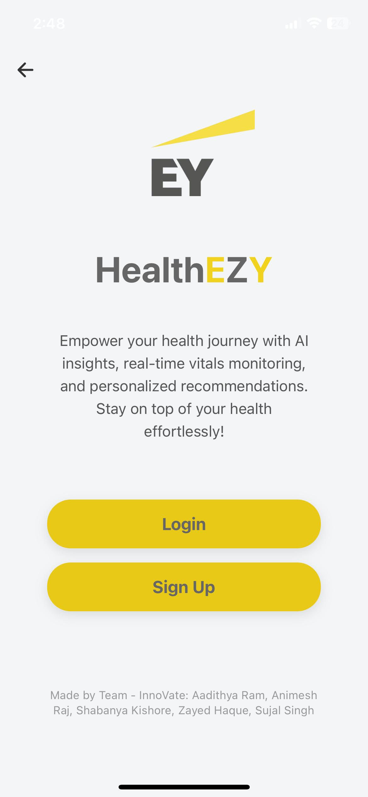

# HealthEZY - AI-Powered Healthcare Platform

**HealthEZY** is a cutting-edge AI-driven mobile health platform designed to enhance patient care through real-time health monitoring, intelligent medical insights, and seamless doctor-patient collaboration. By integrating AI analytics, IoT-enabled health tracking, and adaptive treatment planning, HealthEZY empowers proactive healthcare management for diverse user groups, including patients, healthcare providers, and caregivers.

---

## 🌟 **Key Features**

- **Real-Time Health Monitoring:** Continuous tracking of vital signs (heart rate, SpO₂, temperature) through IoT wearables with instant alerts for critical conditions.  
- **AI-Powered HealthEZY Bot:** A smart virtual assistant delivering personalized health insights, report explanations, diet suggestions, and medication guidance.  
- **Doctor/Admin Portal:** Dedicated access for healthcare professionals to update reports, prescribe medications, and design adaptive treatment plans.  
- **Secure Medical Data Sharing:** Encrypted sharing of health records with trusted contacts and verified healthcare professionals.  
- **Interactive Health Dashboard:** Dynamic visualizations of medical data through charts and graphs for easy understanding of complex health metrics.  
- **Nearby Resources Locator:** Integration with the **OSRM Map API** to help users locate nearby hospitals, pharmacies, and emergency services.  
- **Automated Treatment Plans:** AI-generated or doctor-curated personalized treatment plans based on patient health history and real-time data.

---
## 📸 **Output Screenshots**

Here are some screenshots showcasing the key features and user interface of **HealthEZY**:

  
  
  

  
  
  

  

---

## 🔧 **Tech Stack**

### **Backend & AI/ML Development**  
- **Python:** AI/ML algorithms and data processing.  
- **Node.js:** Real-time backend and API management.  
- **TensorFlow:** Health data analysis and disease prediction models.  
- **Customized GPT Model API:** Secure, adaptive AI for personalized health insights.  

### **Mobile & Frontend Development**  
- **React Native:** Cross-platform mobile app development.  
- **TypeScript:** Strongly typed frontend development for scalability.  
- **Expo Go:** Fast testing and deployment for mobile applications.  

### **Cloud Infrastructure & Data Management**  
- **Firebase Authentication:** Secure user login and access management.  
- **AWS S3 Storage:** Scalable and secure cloud storage for medical data.  
- **MongoDB Atlas:** Flexible NoSQL data storage for patient information.  

### **IoT Integration & Real-Time Communication**  
- **Custom REST API:** Secure data transfer between IoT devices and backend servers.  
- **WebSockets:** Real-time data streaming for instant alerts and updates.  
- **Docker:** Containerized deployment for scalable cloud environments.  

---

## 🚀 **Future Enhancements**  
- **Advanced Predictive Models** for early disease detection and risk analysis.  
- **Voice-Activated AI Bot** for intuitive, hands-free interaction.  
- **Multi-language Support** to improve accessibility across regions.  
- **Integration with More Wearable Devices** (Apple Watch, Fitbit, etc.).  
- **Health Trend Analysis** for long-term patient monitoring and preventive care.  

---

## 📞 **Contact**

**Project Name:** HealthEZY  
**Developed by:** Team InnoVate  
**Email:** animeshraj57480@gmail.com
**Institution:** SRM Institute of Science and Technology, Chennai  

---

**Empowering Healthcare, One Insight at a Time.**  
